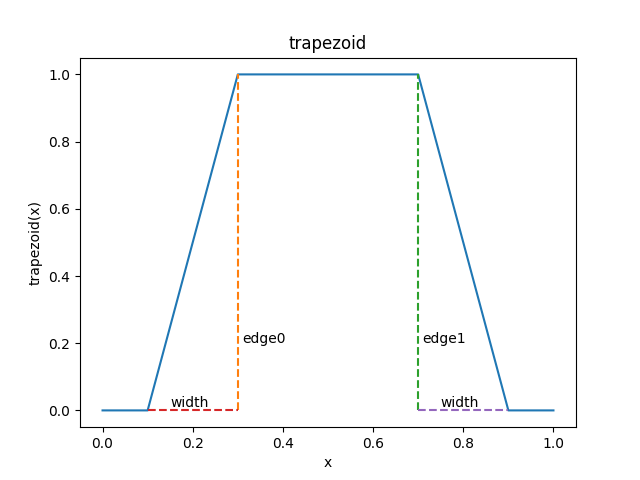

# SDFontApple
A signed distant font generator and a runtime helper for MacOSX and iOS that utilize Metal and CoreText.
This is a retake to my original [SDFont](https://github.com/ShoYamanishi/SDFont), which depends on OpenGL & libfreetype.

SDFontApple consists of the following components:

- **SDFont.xcframework**: The framework for macos and iOS.
- **sdfontgen**: The command-line font processor for macos.
- **SWOpeningRoll**: A sample program for macos and iOS that shows the 3D opening roll of Star Wars film in the signed distance fonts.
- **SWOpeningRollAR**: A sample program for iOS that shows the opening roll in the AR environment anchored at the tapped place.

<a href="doc/StarWarsMacBanner.png"> </a>
<a href="doc/StarWarsARBanner.png"> </a>

[Demo Video 1](https://youtu.be/KLexTjHEyoY) : Video capture from the demo App SWOpeningRoll on Mac mini M1 2020.

[Demo Video 2](https://youtube.com/shorts/o9dAm15HhKc) : Video capture from the demo App SWOpeningRollAR on iPhone 13 mini.

# Table of Contents
- [About Signed Distance Fonts](#about-signed-distance-fonts)
- [Advantages of Signed Distance Fonts](#advantages-of-signed-distance-fonts)
  - [Typographic Effects](#typographic-effects)
- [Build & Instsall](#build--instsall)
  - [SDFont Framework](#sdfont-framework)
  - [Command-line generator: sdfontgen](#command-line-generator-sdfontgen)
  - [Demo App: SWOpeningRoll](#demo-app-swopeningroll)
  - [Demo App: SWOpeningRollAR](#demo-app-swopeningrollar)
- [Usage](#usage)
  - [Find the List of the Available Fonts.](#find-the-list-of-the-available-fonts)
  - [Generating Signed Distance Fonts on Mac Off-line.](#generating-signed-distance-fonts-on-mac-off-line)
  - [Generating Signed Distance Fonts at Runtime.](#generating-signed-distance-fonts-at-runtime)
  - [Using the Signed Distance Fonts for Rendering.](#using-the-signed-distance-fonts-for-rendering)
- [License](#license)
- [Contact](#contact)
- [Background](#background)
- [Acknowledgment](#acknowledgment)

# About Signed Distance Fonts
This is an awesome technique to render typefaces by GPU. It was originally prposed by Chris Green of Valve at SIGGRAPH 2007
[[PDF]](https://steamcdn-a.akamaihd.net/apps/valve/2007/SIGGRAPH2007_AlphaTestedMagnification.pdf).
In the normal font rendering by CPU, say, with [CoreText](https://developer.apple.com/documentation/coretext) or [FreeType](https://freetype.org/), the shapes of the glyphs are stored in the vector (Bezier curve etc.) graphics format, and at runtime, they are drawn to the drawable as a bitmap.

On the contrary, the signed distant fonts techinque generates a texture for the glyphs in the signed distance representation in which the pixels far outside the glyph boundaries get 0, the pixels at the boundaries get values near 0.5, and the pixels deep inside the glyphs get 1.0. The glyphs of the same typeface are usually packed into a single texture, and each glyph gets the corresponding rectangular bounding box in the texture coordinates. This texture generation is usually done as an off-line processing.
At runtime, the glyphs are rendered simply by specifying the bounding boxes and the texture to the GPU.

The following image shows a sample signed distance texture. It shows the first 256 glyphs in Helvetica font with the inner and outer bounding boxes for each glyph.

<a href="doc/Helvetica.png"> </a>

# Advantages of Signed Distance Fonts

- ✅ Good visual quality for the wide range of the font sizes with a single signed distance texture. No noticeable jagged edges when magnified.
- ✅ Little overhead for rendering at runtime. No need to convert the vector graphics to a bitmap, as the glyphs have been in a way already rendered to the texture.
- ✅ Dynamic transformation of the typefaces at runtime. You can move, scale, rotate, sheer the typefaces just like the geometric transfomation for the other rendered objects.
- ✅ Typographic effects by the fragment shader. They can be achieved by applying a function to the sampled value from the signed distance texture. In the following sub-section you can see some sample effects with their corresponding fragment functions.

## Typographic Effects
You can change the appearance of the rendered typefaces by changing the output alpha value in the fragment shader.
The following shows some notable effects with their corresponding functions to alter the alpha value.
Please see [the fragment shader code](SWOpeningRoll/rendering/shaders/default_renderer.metal) for the corresponding fragment shader code.

### Step
<a href="doc/step.png"> </a>
<a href="doc/plot_step.png"> </a>

### Smooth Step
<a href="doc/smooth_step.png"> </a>
<a href="doc/plot_smooth_step.png"> </a>

### Slope Step
<a href="doc/slope_step.png"> </a>
<a href="doc/plot_slope_step.png"> </a>

### Pass-through
<a href="doc/pass_through.png"> </a>
<a href="doc/plot_pass_through.png"> </a>

### Trapezoid
<a href="doc/trapezoid.png"> </a>
<a href="doc/plot_trapezoid.png"> </a>

### Twin Peaks
<a href="doc/twin_peaks.png"> </a>
<a href="doc/plot_twin_peaks.png"> </a>

### Halo Effect
<a href="doc/halo.png"> </a>
<a href="doc/plot_halo.png"> </a>

### Drop Shadow
<a href="doc/drop_shadow.png"> </a>

A drop shadow can be implemented by two render paths. In this example, the drop shadow is renered first by the smooth step shader in black, and then the typeface is rendered by the smooth step shader (with a narrower band) in yellow.

# Build & Instsall

## SDFont Framework
1. Open `SDFontApple/SDFont/SDFont.xcodeproj`, go to the project `SDFont`, and select the target `SDFont`.
2. Set Signing & Capabilities to your environment for your developer ID.
3. Select the sceme `SDFont`, and the taret to your device (ex. My Mac or iPhone 13 mini), and build.

Alternatively, after the signing & capabilities have been setup for you, you can also run the convenience build process with a batch script.
1. Open a terminal
2. `$ xcode-select -s <path/to/Xcode.app>` first if necessary.
3. `$ cd SDFontApple/SDFont`
4. `$ ./build_all.sh`
5. During the execution of the shell script you will be asked if you want to install the macos version to */Library/Frameworks*.
```
Do you wish to install SDFont.framework--macosx to this Mac under /Library/Frameworks?
```
Answer Y/n.

This will create *build/SDFont.scframework*, *build/sdfontgen*, and *./SDFont.doccarchive*.

## Command-line generator: sdfontgen
1. Open `SDFontApple/SDFont/SDFont.xcodeproj`, go to the project `SDFont`, and select the target `sdfontgen`.
2. Set Signing & Capabilities to your environment for your developer ID.
3. Select the sceme `sdfontgen`, and the taret to your device (ex. My Mac), and build.

## Demo App: SWOpeningRoll
1. Open `SDFontApple/SWOpeningRoll/SWOpeningRoll.xcodeproj`, go to the project `SWOpeningRoll`, and select the target `SWOpeningRollmacos` for macOS or the target 'SWOpeningRollios` for iOS.
2. Set Signing & Capabilities to your environment for your developer ID.
3. Adjust the path to SDFont if necessary.
4. Select the sceme `SWOpeningRollmacos` or `SWOpeningRollios`, and the taret to your device (ex. My Mac or iPhone 13 mini), and build & run.

## Demo App: SWOpeningRollAR
1. Open `SDFontApple/SWOpeningRollAR/SWOpeningRollAR.xcodeproj`, go to the project `SWOpeningRollAR`, and select the target `SWOpeningRollAR`.
2. Set Signing & Capabilities to your environment for your developer ID.
3. Adjust the path to SDFont if necessary.
4. Select the sceme `SWOpeningRollAR`, and the taret to your device (ex. iPhone 13 mini), and build & run.

# Usage
An API reference is available in docc archive, which can be found in `SDFontApple/SDFont/SDFont.doccarchive` if you have run `SDFontApple/SDFont/build_all.sh`.

## Find the List of the Available Fonts.
On macos, run `sdfontgen -showfontlist`.
```
mrbean@Beans-Mini % pwd                      
/Users/mrbean/repos/SDFontApple/SDFont/build
mrbean@Beans-Mini % ./sdfontgen -showfontlist
    [..SFCompactRounded-Regular]
    [.AlBayanPUA]
    [.AlBayanPUA-Bold]
    [.AlNilePUA]
...
    [YuppySC-Regular]
    [YuppyTC-Regular]
    [ZapfDingbatsITC]
    [Zapfino]
```

For iOS and macos, you can get the list programatically by calling the following API function.
```
SDFontRuntimeHelper {
    static func listAvailableFonts() -> [String]
}
```
Please consult [https://developer.apple.com/fonts/](https://developer.apple.com/fonts/) for the official information from Apple.

## Generating Signed Distance Fonts on Mac Off-line.
You can use the command-line tool `sdfontgen`.

```
mrbean@Beans-Mini % ./sdfontgen -h           

sdfontgen : command-line signed distance font generator for macos.

options

    -h/--help: show this message

    -verbose: show INFO and WARNING messages

    -showfontlist: show the list of the fonts in the system

    -fontname <fontname>: name of the font, preferrably in Postscript name,
        e.g. -fontname Helvetica

    -glyphnumcutoff <integer num>: maximum index of the glyphs to process.

    -spread <real num>: specifies the margin around each glyph in the fraction
        of the average glyph width and height. Usually within the range of [0.1,0.2].

    -upsample <integer num>: specifies the fontsize in the integer multiple to the original
        font size, in order to sample the glyph bitmaps. The original fontsize
        is determined as the best size to pack the glyphs to the output texture of
        the specified size. For example if the side length of the output texture
        is 2048, and the font is Helvecita with about 2000 glyphs, then the best
        font size will be 43.0. If the upsample factor is 4, then the font size 172.0
        is used to sample the glyph bitmap and to generate signed distance.
        Usually within the range of [2,4].

    -texturesize <integer num>: the length of the sides in pixels of the output texture.
        Usually within the range of [512,4096].

    -outputpath <path>: the path in which the output PNG and JSON files are stored.
        If the outputpath is "/path/to/output", and fontname is "Helvetica",
        then the output files will be /path/to/output/Helvetica.png and /path/to/output/Helvetica.json.

NOTES on -glyphnumcutoff:
  This is useful for example, if you want a small texture size for some games,
  and you know you use only the first 256 glyphs. However, you should be careful
  as the CoreText's typesetter may select a ligature glyph such as 'fi' and 'ff'
  whose indices are above 255, even if you use only English alphabets.
```

### Sample Usage
For a Signed Distance font for Helvetica-Bold, the output texture size of 2048x2048:
```
mrbean@Beans-Mini % ./sdfontgen -verbose -fontname Helvetica-Bold -spread 0.2 -upsample 4 -texturesize 2048 -outputpath .

sdfontgen : generating signed distance fonts with the following parameters.
  font name: [Helvetica-Bold]
  glyph number cut-off: [0]
  spread: [0.2]
  up-sample factor: [4]
  texture size: [2048]
  output path: [.]
INFO: Number of glyphs in font Helvetica-Bold: [2252].
INFO: Number of glyphs after cut-off: [2252].
INFO: Reference Font size: [42.0].
INFO: Spread in pixels: [5.122411719096914]
INFO: Occupancy Rate: [0.7282965183258057]
INFO: Up-sampled per-glyph texture side length: [288]
INFO: Up-sampled font size: [168.0]
INFO: Bounding box for glyph 1 is degenerate. Skipping.
...
INFO: Bounding box for glyph 1327 is degenerate. Skipping.
INFO: Total processing time: 4.357048988342285 seconds. 
INFO: PNG file path to write [./Helvetica-Bold.png -- file:///Users/shoichiroyamanishi/workarea/repo/SDFontApple/SDFont/build/]: 
INFO: JSON file path to write [./Helvetica-Bold.json -- file:///Users/shoichiroyamanishi/workarea/repo/SDFontApple/SDFont/build/]: 
sdfontgen: finished processing.

mrbean@Beans-Mini build % ls -l Helvetica-Bold.*
-rw-r--r--@ 1 mrbean museumstaff  243331 Oct 25 02:15 Helvetica-Bold.json
-rw-r--r--  1 mrbean museumstaff  903737 Oct 25 02:15 Helvetica-Bold.png
```
This will generate two files: *Helvetica-Bold.png* and *Helvetica-Bold.json*.

## Generating Signed Distance Fonts at Runtime.
You can use the class `SDFontGenerator` as follows.
Following is a gist of what you should do.
```
import SDFont
let sdGenerator = SDFontGenerator(
    device                             : MTLCreateSystemDefaultDevice()!,
    fontName                           : "Helvetica-Bold",
    outputTextureSideLen               : 2048
    spreadFactor                       : 0.2,
    upSamplingFactor                   : 4,
    glyphNumCutoff                     : 0, // 0 means no limit
    verbose                            : true
    usePosixPath                       : false // for iOS and macOS GUI Apps, set it false. For macos commandline Apps, which has no access-limits/sand-boxing to the file system, set true.
)
```
You will get two types of output: a generated signed distance texture, and a list of bounding boxes.

To retrieve them, you can either save them to the specified files in PNG and JSON,
```
let rtn1 = sdGenerator.writeToPNGFile(fileName: fontName, path: outputPath ) // This cannot be called, if generateMTLTexture() has been already called.
if !rtn1 {
    print ("ERROR: cannot write PNG file [\(outputPath)/\(fontName).png]")
}
let rtn2 = sdGenerator.writeMetricsToJSONFile(fileName: fontName, path: outputPath )
if !rtn2 {
    print ("ERROR: cannot write JSON file [\(outputPath)/\(fontName).json]")
}
```
or you can retrieve them as MTLTexture and [CGRect].
```
let texture : MTLTexture? = sdGenerator.generateMTLTexture() // Generated signed distance texture.
let bounds : [CGRect] = sdGenerator.generateTextureBounds()  // List of bounding boxes for the glyphs.
```

## Using the Signed Distance Fonts for Rendering.
You can use the class `SDFontRuntimeHelper`.
Following is a gist of what you should do.
```
// from the PNG/JSON file pair:
let helper = SDFontRuntimeHelper(
    device       : MTLCreateSystemDefaultDevice()!,
    fontName     : "Helvecita-Bold",
    fontSize     : 12,
    fileName     : "Helvetica-Bold",
    path         : nil,
    usePosixPath : false,
    verbose      : Bool
)

// from the instance of SDFontGenerator
let helper = SDFontRuntimeHelper( generator: sdGenerator, fontSize: 12, verbose: true )
```
After instantiating the SDFontRuntimeHelper you can perform the following.
```
// get the signed distance texture in MTLTexture
let texture = helper.texture()

// perform typesetting.
let bounds : [GlyphBound] = helper.typeset(
    frameRect     : CGRectMake( -150, -150, 300, 300),
    textPlain     : "Gesha coffee, sometimes referred to as Geisha coffee, is a variety of coffee tree that originated in the Gori Gesha forest, Ethiopia."
    lineAlignment : .left // CTTextAlignment
)
```
The typeset data are provied in the array of `GlyphBound`.
```
struct GlyphBound {
    let frameBound   : CGRect // The rectangular bounding box in the specified drawing area.
    let textureBound : CGRect // The rectangular bounding box of the glyph in the texture coodinate space.
}
```
Each glyph is represented by GlyphBound. Please note that there is no one-by-one mapping between the character sequence of the string you spefied oto `textPlain` and the glyph sequence for the list in `bounds'. The member `frameBound` is used to generate the coordinates for the quad (or two triangles), and 'textureBound' for their texture uv-coordinates.

As a sample for mesh generation and text rendering with Metal, please find `SDTextPlane.generateVerticesAndIndices()`
in [SWOpeningRoll/shared/SDTextPlane.swift](./SWOpeningRoll/shared/SDTextPlane.swift).


# License

GPL v3.

Commercial use with proper attribution can be considered.
Especially for indy developers and small businesses owners a very reasonable licensing can be arranged.

# Contact
For technical and commercial inquiries, please contact: Shoichiro Yamanishi

yamanishi72@gmail.com

# Background
This is a retake to my [SDFont](https://github.com/ShoYamanishi/SDFont), which depends on OpenGL & libfreetype.
[SDFont](https://github.com/ShoYamanishi/SDFont) used to work for macOS but not anymore since Apple stopped supporting OpenGL.
Also, I wanted to port SDFont to iOS but I quickly found it was difficult to use FreeType on iOS as the font files are in accessible to the user Apps.
On the other hand, Apple eco-system provides an excellent typesetting framework called CoreText, and a CPU computing facility called Metal Compute shaders, which can be used for the signed distance generation.

This lack of support for OpenGL and libfreetype and availability of CoreText and Metal have motivated me to develope another SDFont framework for the Apple eco-system.

# Acknowledgment
Special thanks to [Warren Moore](https://warrenmoore.net/) for [the accompanying sample code](https://github.com/metal-by-example/sample-code/tree/master/objc/12-TextRendering) to his excellent book [Metal by Example](https://metalbyexample.com) I purchased. I learned a lot about CoreText from his obj-c code, especially how the various coordinate systems in CoreText work together with CoreGraphics.
(His signed font generator uses a dynamic-programming algorithm (essentially a variant of Dijkstra), which is diffeicult to parallelize. My implementation uses Metal Compute and a per-pixel brute-force vicinity search, which can be parallelized in GPU.)
